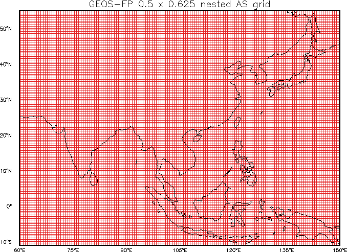

---

layout: posts
title: GEOS-Chem 모델 모의 해보기 (nesting)
author: 도세원, 심창섭, 서정빈
categories: []
tags: [GEOS-Chem]
---


<p style="text-align:right">작성 : 도세원 (한국환경연구원, KEI)<br/> 
& 심창섭 (한국환경연구원, KEI)<br/>& 서정빈 (한국환경연구원, KEI)<br/>2024년 7월 24일</p>


---


## 소 개

이번 메뉴얼에서는 GEOS-Chem nested-grid 옵션을 사용하여 모델을 모의하는 방법을 정리하였다. GEOS-Chem nested-grid 옵션에 대한 자세한 내용을 알고 싶다면 [GEOS-Chem doc](https://geos-chem.readthedocs.io/en/stable/supplemental-guides/nested-grid-guide.html)와 [GEOS-Chem wiki](https://wiki.seas.harvard.edu/geos-chem/index.php/Setting_up_GEOS-Chem_nested_grid_simulations)를 참조하길 바란다. 기본적인 GEOS-Chem 모의는 이전 게시글에 정리하였으므로, [여기](https://swdo1312.github.io/GEOS-Chem_Tutor/)를 참조. 

<br/>

네스팅을 사용하여 GEOS-Chem 모델을 수행하는데는 **두가지 과정**이 필요하다.

* **1. global 도메인에서 모델 수행**

* **2. nested-grid 도메인에서 모델 수행**

<br/>


GEOS-Chem 에서 nested-grid 사용시 추천되는 해상도에 따른 영역의 범위는 [여기](https://wiki.seas.harvard.edu/geos-chem/index.php/FlexGrid#0.5.C2.B0_x_0.625.C2.B0_nested_Asia)를 참고하길 바란다. 이번 메뉴얼에서는 한반도가 포함된 영역을 사용할 것이며, 영역은 아래 그림과 같다.

 
<br/>
< 그림 [출처](https://wiki.seas.harvard.edu/geos-chem/index.php/GEOS-Chem_horizontal_grids#0.5_x_0.625_AS_nested_grid) >


---

## 모델 및 자료 가져오기

GEOS-Chem 모델을 사용하기 위해서는 모델 소스코를 다운로드가 필요하다. 자세한 설명은  [여기](https://geos-chem.readthedocs.io/en/14.2.1/getting-started/quick-start.html)를 참조.

* GEOS-Chem 모델 다운로드

  ``` bash
  cd ~/MODL/geoschem/
  git clone --recurse-submodules https://github.com/geoschem/GCClassic.git GCClassic
  ```

  참고) 원하는 경우 폴더 이름을 수정할 수 있음

  ```
  git clone --recurse-submodules https://github.com/geoschem/GCClassic.git my_code_dir
  ```


저자의 경우 GCClassic 버전이 업그레이드 되는 것을 고려하여 폴더를 정리하기 위해 ~/MODL/geoschem/ 폴더에 저장된 GCClassic 폴더를 GEOS-Chem 버전에 맞게 이동하여 사용하였음(2024.07.19기준 최신버전, v14.4.1).

``` bash
vi GCClassic/CHANGELOG.md
 버전 확인 
mkdir Code.14.4.1
mv -r GCClassic/ Code.14.4.1
```


- GEOS-Chem 입력자료를 저장할 경로 설정 

  GEOS-Chem을 수행하기 위해 입력자료를 다운로드 받을 디렉토리를 설정하여야 한다. 공용서버에서 작업을 하는 사용자라면 chmod 권한을 통해 여러 사용자가 동일한 입력자료를 중복으로 다운로드하지 않도록 사용하는 것을 추천한다. 

  ``` bash
  mkdir ~/MODL/geoschem/ExtData/
  ```


---


## 1. global 도메인에서 모델 수행하기


## 1.1  실행 디렉토리 생성

GEOS-Chem을 수행하기 위해 컴파일 할 디렉토리를 성정하여야 한다. 앞으로 여러 실험을 수행할 것을 대비하여 rundirs/ 폴더를 만들고 그 안에 모델을 컴파일 하였다. 

``` bash
mkdir ~/MODL/geoschem/Code.14.4.1/rundirs
cd ~/MODL/geoschem/Code.14.4.1/GCClassic/run
./createRunDir.sh
```


GEOS-Chem 모델을 수행하기 위한 몇가지 옵션을 선택하여야 한다. 이번 튜토리얼에서는 수행하는 옵션은 아래와 같다. 정상적으로 수행되었다면, 옵션에서 선택한 값들이 사용된 폴더명이 생성될 것이다.


``` bash
-----------------------------------------------------------
Choose simulation type:
-----------------------------------------------------------
   1. Full chemistry
   2. Aerosols only
   3. Carbon
   4. Hg
   5. POPs
   6. Tagged O3
   7. TransportTracers
   8. Trace metals
   9. CH4
  10. CO2
  11. Tagged CO
>>> 9

-----------------------------------------------------------
Choose meteorology source:
-----------------------------------------------------------
  1. MERRA-2 (Recommended)
  2. GEOS-FP
  3. GEOS-IT (Beta release)
  4. GISS ModelE2.1 (GCAP 2.0)
>>> 1

-----------------------------------------------------------
Choose horizontal resolution:
-----------------------------------------------------------
  1. 4.0  x 5.0
  2. 2.0  x 2.5
  3. 0.5  x 0.625
>>> 1

-----------------------------------------------------------
Choose number of levels:
-----------------------------------------------------------
  1. 72 (native)
  2. 47 (reduced)
>>> 1

-----------------------------------------------------------
Enter path where the run directory will be created:
-----------------------------------------------------------
>>> ~/MODL/geoschem/Code.14.4.1/rundirs
Expanding to ~/MODL/geoschem/Code.14.4.1/rundirs

-----------------------------------------------------------
Enter run directory name, or press return to use default:

NOTE: This will be a subfolder of the path you entered above.
-----------------------------------------------------------
>>>
  -- Using default directory name gc_2x25_47L_merra2_CH4
  -- See rundir_vars.txt for summary of default run directory settings
  -- This run directory has been set up to start on 20190101
  -- A restart file for this date has been copied to the Restarts subdirectory
  -- You may add more restart files using format GEOSChem.Restart.YYYYMMDD_HHmmz.nc4
  -- Change simulation start and end dates in configuration file geoschem_config.yml
  -- Default frequency and duration of diagnostics are set to monthly
  -- Modify diagnostic settings in HISTORY.rc and HEMCO_Config.rc

  -- The following sample restart provided for this simulation was not found:
     /${your_path}/MODL/geoschem/ExtData/GEOSCHEM_RESTARTS/v2020-02/GEOSChem.Restart.CH4.20190101_0000z.nc4
     You will need to provide this initial restart file or disable
     GC_RESTARTS in HEMCO_Config.rc to initialize your simulation
     with default background species concentrations.

-----------------------------------------------------------
Do you want to track run directory changes with git? (y/n)
-----------------------------------------------------------
>>> n


Created  ~/MODL/geoschem/Code.14.4.1/rundirs/gc_4x5_merra2_CH4
```


---


## 1.2 빌드 구성 및 컴파일

GEOS-Chem은 실행 디렉토리 또는 시스템의 다른 곳에서 빌드할 수 있다. 그러나, 실행 디렉토리에서 GEOS-Chem을 빌드하는 것을 추천한다.  실행 디렉토리에서 빌드를 수행할 경우 모든 빌드 파일이 모델을 실행할 위치와 가까운 곳에 보관되므로 편리하게 사용할 수 있다.

``` bash
cd ~/MODL/geoschem/Code.14.4.1/rundirs/gc_4x5_merra2_CH4/build
cmake ../CodeDir -DRUNDIR=..
make -j
make install
```

위 과정을 따라서 컴파일에 성공하였다면 /build/bin/gcclassic 파일이 생성된다.


## 1.3 HISTORY.rc 필수 수정사항

GEOS-Chem 모델을 수행을 통해 계산된 진단 변수들에 대한 저장을 설정하는 파일이다.


- global 도메인에서 수행된 모델로 nested-grid의 경계자료('BoundaryConditions')을 만들어야 하기 때문에 아래와 같이 주석('#')을 제거가 필요하다.

  ```
  #==============================================================================
  # %%%%% COLLECTION NAME DECLARATIONS %%%%%
  #
  # To enable a collection, remove the "#" character in front of its name. The
  # Restart collection should always be turned on.
  #
  # NOTE: These are the "default" collections for GEOS-Chem, but you can create
  # your own customized diagnostic collections as well.
  #==============================================================================
  COLLECTIONS: 'Restart',                                  # 저장할 변수들 설정
               'CH4',                                      # 파일명 : ${EXPID}.'Restart'*.nc4 or ${EXPID}.'CH4'*.nc4 
               'Metrics',
               'SpeciesConc',
               #'Budget',
               #'CloudConvFlux',
               #'ConcAfterChem',
               #'LevelEdgeDiags',
               #'SatDiagn',
               #'SatDiagnEdge',
               'StateMet',
               'BoundaryConditions',     # <===== 필수적으로 주석('#')을 제거해줘야 한다!.
  ::
  ```


- **기본적인 옵션**

  ```
  #==============================================================================
  # %%%%% THE BoundaryConditions COLLECTION %%%%%
  #
  # GEOS-Chem boundary conditions for use in nested grid simulations
  #
  # Available for all simulations
  #==============================================================================
    BoundaryConditions.template:   '%y4%m2%d2_%h2%n2z.nc4',                # 저장될 파일명 설정
    BoundaryConditions.frequency:  00000000 030000                         # [YYYYMMDD hhmmss] : 3시간에 한번씩 결과 저장
    BoundaryConditions.duration:   00000001 000000                         # [YYYYMMDD hhmmss] : 1일에 한번씩 netCDF 파일 생성
    BoundaryConditions.mode:       'instantaneous'                         # 'instantaneous' : 스냅샷, 'time-averaged' : 시간 평균
    BoundaryConditions.LON_RANGE:  60.0 150.0,                             # [최소값, 최대값] : 생성될 경계장 범위 설정 (lon)
    BoundaryConditions.LAT_RANGE:  -11.0 55.0,                             # [최소값, 최대값] : 생성될 경계장 범위 설정 (lat)
    BoundaryConditions.fields:     'SpeciesBC_?ADV?             ', 'GIGCchem',
  
  ```

---


## 1.4 GEOS-Chem Classic 실행

모든 실험에 대한 옵션 설정이 끝났다면, GEOS-Chem Classic을 실행을 위한 준비가 끝났다. 이제는 수행기간에 따른 HEMCO 자료를 다운 받고 모델을 수행하면 된다. 모델을 dryrun 옵션을 사용하여 수행한다.


GEOS-Chem Classic 모의 순서는 :

- 모델 수행 기간 HEMCO 데이터 유무 확인 (./gcclassic --dryrun)
- 모델 수행 기간 부족한 HEMCO 데이터 다운로드 (./dowuload_data.py)
- 모델 수행 (./gcclassic)


### 1.4.1 “HEMCO 데이터 유무 확인” 

아래와 같이 --dryrun 명령어를 사용하여 GEOS-Chem Classic 실행 파일을 실행한다. 여기서 " | tee" 옵션을 통해 출력 결과를 log.dryrun 에 저장한다.

``` bash
./gcclassic --dryrun |tee log.dryrun
```

수행된 결과를 확인해보면 일반적인 GEOS-Chem 로그 파일과 다소 비슷해 보이지만 데이터 파일 목록과 각 파일이 디스크에서 저장이되어 있는지를 포함하고 있다. 이 정보를 바탕으로 다운로드가 되지 않은 파일은 다음 단계에서 다운로드 받게 된다.

(참고) log.dryrun 파일명은 수정하여 사용하여도 된다. 그러나, 모델 수행기간에 필요한 HEMCO 데이터에 대한 정보가 이 log 파일에 포함되어 있으니 다음 단계에서도 동일한 log 파일명을 사용하여야 한다.


### 1.4.2 “부족한 HEMCO 데이터 다운로드” 

다운로드 되지 않은 HEMCO 파일의 정보는 log.dryrun 에 기록되어 있다. 관련 데이터를 다운로드 받을 수 있는 몇가지 경로가 있지만 WashU(세인트루이스의 워싱턴 대학교) 사이트 ( [http://geoschemdata.wustl.edu](http://geoschemdata.wustl.edu/) )에서 데이터를 다운로드하는 것을 추천한다. WashU의 Randall Martin 그룹에서 관리하는 GEOS-Chem의 주요 데이터 사이트이다.

``` bash
./dowuload_data.py log.dryrun wu
```


### 1.4.3. “모델 수행 (./gcclassic)” 

``` bash
./gcclasic > log.run
```

모델이 정상적으로 수행되었다면 log.run 파일 맨 밑에 "E N D   O F   G E O S -- C H E M" 을 확인할 수 있을 것이다. 모델 결과는 HISTORY.rc 에서 설정한 경로에 따라 NetCDF 파일(예: `OutputDir/GEOSChem*.nc4`및 `OutputDir/HEMCO*.nc`)로 저장되어 있을 것이다. 이 결과 파일들은 netCDF 형식으로 만들어진 것이므로 [ncview](http://meteora.ucsd.edu/~pierce/ncview_home_page.html) 등으로 간단히 확인할 수 있습니다.


정상적으로 수행 되었다면 /OutputDir/GEOSChem.BoundaryConditions.* 파일을 확인할 수 있을 것이다.  이 파일은 nested-grid 도메인에서 경계자료로 사용된다.


---

## 2. nested-grid 도메인에서 모델 수행하기

## 2.1 nested-grid 실행 디렉토리 생성

GEOS-Chem을 수행하기 위해 컴파일 할 디렉토리를 성정하여야 한다. 앞으로 여러 실험을 수행할 것을 대비하여 rundirs/ 폴더를 만들고 그 안에 모델을 컴파일 하였다. 

``` bash
mkdir ~/MODL/geoschem/Code.14.4.1/rundirs
cd ~/MODL/geoschem/Code.14.4.1/GCClassic/run
./createRunDir.sh
```


nested-grid 실험을 위한 옵션을 선택하여야 한다. global 도메인과 동일하게 선택하되, 해상도를 고해상도로 선택하면 된다. 이번 튜토리얼에서는 nested-grid의 해상도를 0.2º x 0.625º 로 설정하였다.


``` bash
-----------------------------------------------------------
Choose simulation type:
-----------------------------------------------------------
   1. Full chemistry
   2. Aerosols only
   3. Carbon
   4. Hg
   5. POPs
   6. Tagged O3
   7. TransportTracers
   8. Trace metals
   9. CH4
  10. CO2
  11. Tagged CO
>>> 9

-----------------------------------------------------------
Choose meteorology source:
-----------------------------------------------------------
  1. MERRA-2 (Recommended)
  2. GEOS-FP
  3. GEOS-IT (Beta release)
  4. GISS ModelE2.1 (GCAP 2.0)
>>> 1

-----------------------------------------------------------
Choose horizontal resolution:
-----------------------------------------------------------
  1. 4.0  x 5.0
  2. 2.0  x 2.5
  3. 0.5  x 0.625
>>> 3

-----------------------------------------------------------
Choose number of levels:
-----------------------------------------------------------
  1. 72 (native)
  2. 47 (reduced)
>>> 1

-----------------------------------------------------------
Enter path where the run directory will be created:
-----------------------------------------------------------
>>> ~/MODL/geoschem/Code.14.4.1/rundirs
Expanding to ~/MODL/geoschem/Code.14.4.1/rundirs

-----------------------------------------------------------
Enter run directory name, or press return to use default:

NOTE: This will be a subfolder of the path you entered above.
-----------------------------------------------------------
>>>
  -- Using default directory name gc_05x0625_merra2_CH4
  -- See rundir_vars.txt for summary of default run directory settings
  -- This run directory has been set up to start on 20190101
  -- A restart file for this date has been copied to the Restarts subdirectory
  -- You may add more restart files using format GEOSChem.Restart.YYYYMMDD_HHmmz.nc4
  -- Change simulation start and end dates in configuration file geoschem_config.yml
  -- Default frequency and duration of diagnostics are set to monthly
  -- Modify diagnostic settings in HISTORY.rc and HEMCO_Config.rc

  -- The following sample restart provided for this simulation was not found:
     /${your_path}/MODL/geoschem/ExtData/GEOSCHEM_RESTARTS/v2020-02/GEOSChem.Restart.CH4.20190101_0000z.nc4
     You will need to provide this initial restart file or disable
     GC_RESTARTS in HEMCO_Config.rc to initialize your simulation
     with default background species concentrations.

-----------------------------------------------------------
Do you want to track run directory changes with git? (y/n)
-----------------------------------------------------------
>>> n


Created  ~/MODL/geoschem/Code.14.4.1/rundirs/gc_05x0625_merra2_CH4
```


## 2.2 빌드 구성 및 컴파일

GEOS-Chem은 실행 디렉토리 또는 시스템의 다른 곳에서 빌드할 수 있다. 그러나, 실행 디렉토리에서 GEOS-Chem을 빌드하는 것을 추천한다.  실행 디렉토리에서 빌드를 수행할 경우 모든 빌드 파일이 모델을 실행할 위치와 가까운 곳에 보관되므로 편리하게 사용할 수 있다.

``` bash
cd ~/MODL/geoschem/Code.14.4.1/rundirs/gc_05x0625_merra2_CH4/build
cmake ../CodeDir -DRUNDIR=..
make -j
make install
```

위 과정을 따라서 컴파일에 성공하였다면 /build/bin/gcclassic 파일이 생성된다.


## 2.3 geoschem_config.yml 필수 수정사항

```
#============================================================================
# Grid settings
#============================================================================
grid:
  resolution: 0.5x0.625
  number_of_levels: 72
  longitude:
    range: [60.0, 150.0]                                       # global 도메인에서 설정한 lon 값보다 같거나 적은 영역으로 설정
    center_at_180: true
  latitude:
    range: [-11.0, 55.0]                                       # global 도메인에서 설정한 lat 값보다 같거나 적은 영역으로 설정
    half_size_polar_boxes: false
  nested_grid_simulation:                                      # nested-grid 를 사용하는지? 
    activate: true                                             # 사용(true), 미사용(false)  : 여기서는 true로 설정
    buffer_zone_NSEW: [3, 3, 3, 3]                             # buffer_zone grid를 설정. 추천값 [3,3,3,3]

#============================================================================
#============================================================================
# Timesteps settings
#============================================================================
timesteps:                                                     # 모델의 적분시간 간격 설정, 모델 해상도에 맞게 설정
  transport_timestep_in_s: 300                                 # 대기수송모델 계산 간격 [추천] 전역(600), nesting(300)
  chemistry_timestep_in_s: 600                                 # 화학반응 및 배출 간격: [추천] 전역(1200), nesting(600)


```


## 2.4 HEMCO_Config.rc 필수 수정사항

```
###############################################################################
### BEGIN SECTION EXTENSION SWITCHES
###############################################################################
# ExtNr ExtName                on/off  Species   Years avail.
0       Base                   : on    *
# ----- MAIN SWITCHES ---------------------------------------------------------
    --> EMISSIONS              :       true
    --> METEOROLOGY            :       true      # 1980-2021
    --> CHEMISTRY_INPUT        :       true
# ----- RESTART FIELDS --------------------------------------------------------
    --> GC_RESTART             :       true
# ----- NESTED GRID FIELDS ----------------------------------------------------   # nested-grid 와 관련된 설정
    --> GC_BCs                 :       true                                       # BoundaryConditions 사용 (true)
# ----- REGIONAL INVENTORIES --------------------------------------------------
    --> GHGI_v2                :       false    # 2012-2018
    --> GHGI_v2_Express_Ext    :       true     # 2012-2020
    --> Scarpelli_Canada       :       true     # 2018
    --> Scarpelli_Mexico       :       true     # 2015
# ----- GLOBAL INVENTORIES ----------------------------------------------------


#==============================================================================   # 사용될 BoundaryConditions 경로 설정
# --- GEOS-Chem boundary condition file ---                                       # 각자 계정에 맞게 경로 설정
#==============================================================================   # ${PATH} 위치 수정
(((GC_BCs
* BC_ /${PATH}/GEOSChem.BoundaryConditions.$YYYY$MM$DD_0000z.nc4 SpeciesBC_?ADV?  1900-2100/1-12/1-31/* EFY xyz 1 * - 1 1
)))GC_BCs

(ex) $PATH} = /home/swdo1312/MODL/geoschem/Code.14.4.1/rundirs/gc_4x5_merra2_CH4/OutputDir/
```


## 2.5 GEOS-Chem Classic 실행

모든 실험에 대한 옵션 설정이 끝났다면, GEOS-Chem Classic을 실행을 위한 준비가 끝났다. 이제는 수행기간에 따른 HEMCO 자료를 다운 받고 모델을 수행하면 된다. 모델을 dryrun 옵션을 사용하여 수행한다.


GEOS-Chem Classic 모의 순서는 :

- 모델 수행 기간 HEMCO 데이터 유무 확인 (./gcclassic --dryrun)
- 모델 수행 기간 부족한 HEMCO 데이터 다운로드 (./dowuload_data.py)
- 모델 수행 (./gcclassic)


### 2.5.1 “HEMCO 데이터 유무 확인” 

아래와 같이 --dryrun 명령어를 사용하여 GEOS-Chem Classic 실행 파일을 실행한다. 여기서 " | tee" 옵션을 통해 출력 결과를 log.dryrun 에 저장한다.

``` bash
./gcclassic --dryrun |tee log.dryrun
```

수행된 결과를 확인해보면 일반적인 GEOS-Chem 로그 파일과 다소 비슷해 보이지만 데이터 파일 목록과 각 파일이 디스크에서 저장이되어 있는지를 포함하고 있다. 이 정보를 바탕으로 다운로드가 되지 않은 파일은 다음 단계에서 다운로드 받게 된다.

(참고) log.dryrun 파일명은 수정하여 사용하여도 된다. 그러나, 모델 수행기간에 필요한 HEMCO 데이터에 대한 정보가 이 log 파일에 포함되어 있으니 다음 단계에서도 동일한 log 파일명을 사용하여야 한다.


### 2.5.2 “부족한 HEMCO 데이터 다운로드” 

다운로드 되지 않은 HEMCO 파일의 정보는 log.dryrun 에 기록되어 있다. 관련 데이터를 다운로드 받을 수 있는 몇가지 경로가 있지만 WashU(세인트루이스의 워싱턴 대학교) 사이트 ( [http://geoschemdata.wustl.edu](http://geoschemdata.wustl.edu/) )에서 데이터를 다운로드하는 것을 추천한다. WashU의 Randall Martin 그룹에서 관리하는 GEOS-Chem의 주요 데이터 사이트이다.

``` bash
./dowuload_data.py log.dryrun wu
```


### 2.5.3. “모델 수행 (./gcclassic)” 

``` bash
./gcclasic > log.run
```

모델이 정상적으로 수행되었다면 log.run 파일 맨 밑에 "E N D   O F   G E O S -- C H E M" 을 확인할 수 있을 것이다. 모델 결과는 HISTORY.rc 에서 설정한 경로에 따라 NetCDF 파일(예: `OutputDir/GEOSChem*.nc4`및 `OutputDir/HEMCO*.nc`)로 저장되어 있을 것이다. 이 결과 파일들은 netCDF 형식으로 만들어진 것이므로 [ncview](http://meteora.ucsd.edu/~pierce/ncview_home_page.html) 등으로 간단히 확인할 수 있습니다.


---


## 3. 모의 결과 분석

GEOS-Chem 모델을 시각화 하는데 GCPy 프로그램이 많이 사용되고 있다. GCPy 는 Python toolkit 으로 누구나 손 쉽게 사용할 수 있는 장점이 있다. 이와 관련된 내용은 새로운 포스팅에서 소개하고자 한다. 


<p style="text-align:right">작성 : 도세원 (한국환경연구원, KEI) <br/> 
& 심창섭 (한국환경연구원, KEI)<br/>& 서정빈 (한국환경연구원, KEI)<br/>
    2024년 7월 24일</p>


---

<center>- END -</center>

---

 

 

 
