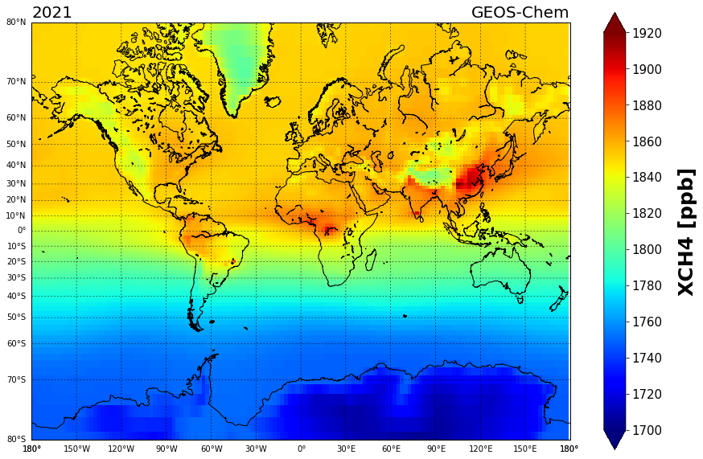
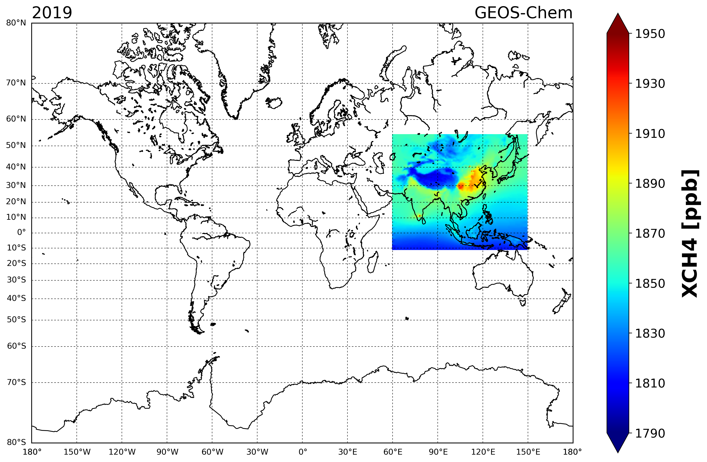

---

layout: posts
title: GEOS-Chem 모델 시각화
author: 도세원, 심창섭, 서정빈
categories: []
tags: [GEOS-Chem]
---


<p style="text-align:right">작성 : 도세원 (한국환경연구원, KEI)<br/> 
& 심창섭 (한국환경연구원, KEI)<br/>& 서정빈 (한국환경연구원, KEI)<br/>2024년 7월 31일</p>


---


## 소 개

이번 메뉴얼에서는 GEOS-Chem 으로 모의된 결과를 시각화하는 내용을 정리하였다. python을 기반으로 하여 시각화를 진행할 예정이다. 가장 기본적인 python과 GEOS-Chem 에서 가장 대표적으로 사용되는 python toolkit (GCPy) 으로  나누어 설명하고자 한다.


**1. 기본적인 python 사용하기**

**2. GCPy 사용하기**

<br/>


****


## 1. 기본적인 python 사용

기본적인 python을 사용하기에 앞서 모델 결과를 지도에 그릴 수 있도록 basemap 패키지를 먼저 다운 받는다.

* basemap 다운로드

  ``` bash
  conda update -n base conda         # anaconda 
  
  conda install basemap
  conda install basemap-data-hires
  ```

  정상적으로 basemap이 설치되었다면 불러오기가 작동 되어야 한다.
  
  ```
  from mpl_toolkits.basemap import Basemap
  import matplotlib.pyplot as plt
  ```


- 간단한 사용을 위한 함수 정의(define)

  python 에서는 def를 통해서 함수를 정의하고 사용할 수 있다.  함수를 통해서 코드를 간단 명료하게 정리 할 수 있다. 이번 메뉴얼에서도 코드를 간략하게 정리하기 위해서  함수 정의를 사용하였다.

  ``` bash
  # 결과 변수의 값을 ppb 단위로 변환하기 위한 함수
  def change_Species_ppb_(date, species):
      Number_density = np.array(Dataset(path + 'GEOSChem.StateMet.'+date+'_0000z.nc4')['Met_AIRDEN']) / 0.02897
      Total_number_air_mol = np.array(Dataset(path + 'GEOSChem.StateMet.'+date+'_0000z.nc4')['Met_AIRVOL']) * Number_density
      Total_number_of_Species = Total_number_air_mol * Dataset(path + 'GEOSChem.SpeciesConc.'+date+'_0000z.nc4')['SpeciesConcVV_'+species]
      calculated_ppb = np.sum(np.sum(Total_number_of_Species,0),0)/np.sum(np.sum(Total_number_air_mol,0),0)*10**9
      
      return calculated_ppb
  
  
  # 결과 변수의 값을 시각화때 colorbar range 설정을 편하게 하기 위한 함수
  def calculated_ppb_range(calculated_ppb):
      ppb_range_max = ((np.ceil(np.amax(calculated_ppb)) //10))*10         # max 값에서 10의 단위 올림
      ppb_range_min = ((np.floor(np.amin(calculated_ppb)) //10) )*10       # min 값에서 10의 단위 올림
      ppb_range_norm = np.arange(ppb_range_min, ppb_range_max+1,10)        # 전체 range를 10 간격으로 나눔 
      
      return ppb_range_max, ppb_range_min, ppb_range_norm
  ```
  
  
  
  
  
  (참고) python에서 함수(define) 사용하는 방법 예시
  
  ``` bash
  # 기본적인 python 함수(define) 예시
  def myfunction():                # myfunction 이라는 이름의 함수를 생성
      print("Hello World")         # 함수를 실행시 "Hello World" 를 출력
      
  myfunction()                     # 함수를 실행하면
  >>> Hello World                  # Hello World 출력됨
  #=======================================================================
  
  # python 함수(define) 매개변수 사용 예시
  def myfunction(arg1, arg2):      # myfunction 이라는 이름의 함수를 생성, 이 함수를 사용하기 위해서 2개 변수를 입력해야 한다.
      print(str(arg1))             # 함수를 실행시 arg1 을 string 형식으로 출력
      print(arg2 + 100)            # 함수를 실행시 arg2 + 100 결과 값 출력
      
  myfunction(100,100)              # 함수를 실행하면
  >>> 100                          # 글자 형식의 arg1(=100) 출력됨
  >>> 200                          # arg2(=100) + 100 = 200 출력됨
  #=======================================================================
  
  # python 함수(define) 매개변수 및 return 사용 예시
  def myfunction(arg1, arg2):      # myfunction 이라는 이름의 함수를 생성, 이 함수를 사용하기 위해서 2개 변수를 입력해야 한다.
      result_arg1 = arg1 + 100     # 함수를 실행시 result_arg1 값 정의 : 100+100 = 200
      result_arg2 = arg2 * 100     # 함수를 실행시 result_arg2 값 정의 : 100*100 = 10000
      return arg1 arg2             # 함수를 실행시 result_arg1, result_arg2 값을 반환
      
  data1, data2 = myfunction(100,100)       # 함수를 실행하면 return 값이 data1, data2 에 반환된다.
  print(data1)                             # data1 은 함수의 계산에 따라 200
  >>> 200
  print(data2)                             # data2 은 함수의 계산에 따라 10000
  >>> 10000
  
  ```


전체 코드는 아래와 같다.

``` bash
import numpy as np
from netCDF4 import Dataset
from mpl_toolkits.basemap import Basemap
import matplotlib.pyplot as plt


path = '{사용자 계정에 따라 모델 결과 폴더로 설정}'  # ex) {HOME}/MODL/geoschem/Code.14.4.1/rundirs/gc_2x25_47L_merra2_CH4/OutputDir/
date = '20211201'                              # 모델 수행시작 시간 설정
species = 'CH4'                                # 어떤 변수를 시각화 할 것인지 설정


def change_Species_ppb_(date, species):
    Number_density = np.array(Dataset(path + 'GEOSChem.StateMet.'+date+'_0000z.nc4')['Met_AIRDEN']) / 0.02897
    Total_number_air_mol = np.array(Dataset(path + 'GEOSChem.StateMet.'+date+'_0000z.nc4')['Met_AIRVOL']) * Number_density
    
    Total_number_of_Species = Total_number_air_mol * Dataset(path + 'GEOSChem.SpeciesConc.'+date+'_0000z.nc4')['SpeciesConcVV_'+species]
    
    calculated_ppb = np.sum(np.sum(Total_number_of_Species,0),0)/np.sum(np.sum(Total_number_air_mol,0),0)*10**9
    
    return calculated_ppb

def calculated_ppb_range(calculated_ppb):
    ppb_range_max = ((np.ceil(np.amax(calculated_ppb)) //10))*10
    ppb_range_min = ((np.floor(np.amin(calculated_ppb)) //10) )*10
        
    ppb_range_norm = np.arange(ppb_range_min, ppb_range_max+1,10)
    
    return ppb_range_max, ppb_range_min, ppb_range_norm
    
    

data = Dataset(path + 'GEOSChem.SpeciesConc.'+date+'_0000z.nc4')

Species_data = change_Species_ppb_(date,species)
range_max_, range_min_, range_norm_ = calculated_ppb_range(Species_data)


plt.figure(figsize=(15,10))

map = Basemap(projection='merc', resolution = 'l',
    urcrnrlat=80, llcrnrlat=-80, llcrnrlon=-180., urcrnrlon=180.)
 
map.drawcoastlines()
# map.drawcountries()
map.drawmapboundary()
map.drawmeridians(range(0, 360, 30), color='k', linewidth=0.5, dashes=[4, 4], labels=[0, 0, 0, 1])
map.drawparallels(range(-90, 100, 10), color='k', linewidth=0.5, dashes=[4, 4], labels=[1, 0, 0, 0])

lon, lat = map(np.meshgrid(data['lon'],data['lat'])[0], np.meshgrid(data['lon'],data['lat'])[1])

pm = map.pcolormesh(lon,lat,Species_data,vmax=range_max_,vmin=range_min_,cmap='jet')
cbar = plt.colorbar(pm,extend='both',ticks=range_norm_[::2])
cbar.set_label('X'+species+' [ppb]',fontsize=25,weight='bold',labelpad=20)
cbar.ax.tick_params(labelsize=15)

plt.title(date[0:6],loc='left',fontsize=20)
plt.title('GEOS-Chem',loc='right',fontsize=20)


# plt.savefig('{HOME}/MODL/geoschem/Code.14.4.1/analysis/figure/'+'test_global_'+date+'.png', dpi=300, bbox_inches='tight')

plt.show()
```








---


## 2. GCPy 사용


---


## 3. 모의 결과 분석

GEOS-Chem 모델을 시각화 하는데 GCPy 프로그램이 많이 사용되고 있다. GCPy 는 Python toolkit 으로 누구나 손 쉽게 사용할 수 있는 장점이 있다. 이와 관련된 내용은 새로운 포스팅에서 소개하고자 한다. 


<p style="text-align:right">작성 : 도세원 (한국환경연구원, KEI) <br/> 
& 심창섭 (한국환경연구원, KEI)<br/>& 서정빈 (한국환경연구원, KEI)<br/>
    2024년 7월 31일</p>


---

<center>- END -</center>

---

 

 

 
